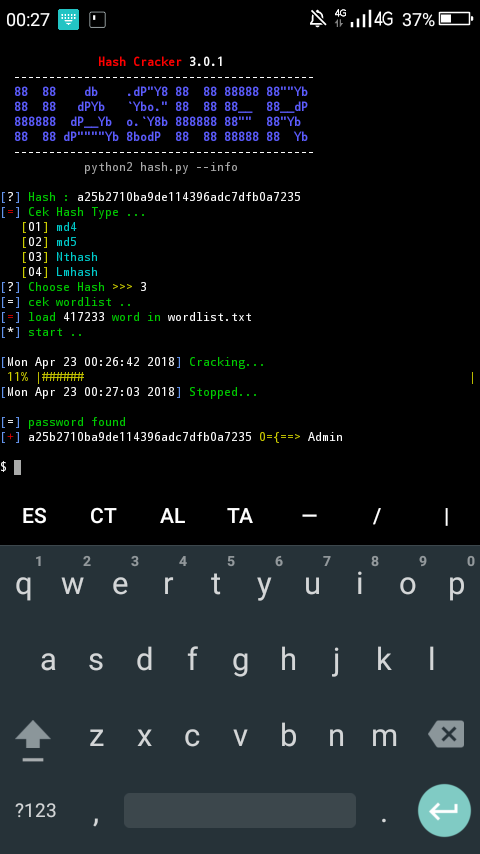

# hasher 2.3.6

Hasher is a Hash Cracker that has supported more than 7 types of hashes

# list hash supported
- md4
- md5
- sha1
- sha224
- sha256
- sha384
- sha512
- ripemd160
- whirlpool

# [Termux]
``` apt update upgrade
apt install python2
apt install git
git clone https://github.com/ciku370/hasher
cd hasher
python2 hash.py ```


